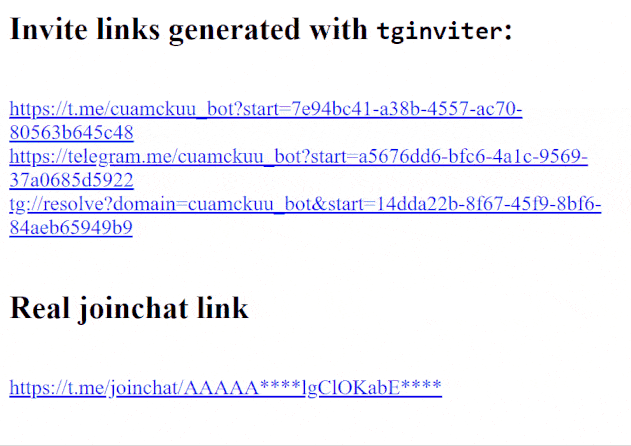

# Telegram Inviter - `tginviter`

`tginviter` is a Python3 module to generate and process personal invite links for Telegram channels.

## Demo


## Why `tginviter`?

Some projects requires personal invite liks for joining channels, because joinchat link is can easy be stolen. Unfortunately, Telegram API and existing Pytohn modules lacks functional to protect invite links, that's why I decided to code it by myself.

## How does it work?

This module combines power of [`python-telegram-bot`](https://github.com/python-telegram-bot/python-telegram-bot) and [`telethon`](https://github.com/LonamiWebs/Telethon) , so that `tginviter` can use bot's and client's Telegram API at the same time.

- `python-telegram-bot` and bot's API is used to process [deeplinks](https://core.telegram.org/bots#deep-linking) and store invite tokens to some kind of users whitelist.

- `telethon` and client's API is used for periodic checks that all users in channels are in whitelist, othervise that user will be banned.

Both actions are highly customizable for your purposes, cause they are specified by callback functions `deeplink_handler` and `job_handler`.

## Installation

For now you could clone repository and copy module to needed location.
**Soon I will add more convinient way to install**.

```bash
git clone https://github.com/cuamckuu/tg-inviter.git
cd tg-inviter
python setup.py install

# Or

python -m pip install git+https://github.com/cuamckuu/tg-inviter.git#egg=tg-inviter
```

## Usage

See `example.py` to find code used in gif.

### Specify your keys in `.env` file or in code:
```bash
# Telethon
export TELETHON_API_ID='12***19'
export TELETHON_API_HASH='48c***559417****120eae******2798'
export TELETHON_SESSION_NAME="./sessions/Inviter.session"

# py-telegram-bot
export TELEGRAM_BOT_TOKEN='13921*****:AAGLC**********v1OMJdy9-****wI6hy-U'
```

### Create callback functions `deeplink_handler` and `job_handler`

In example I did it like so:

```python3
def create_callbacks(storage, client):
    def deeplink_handler(update, context):
        if not context.args:
            return

        token = context.args[0]
        if storage.uses_left(token) <= 0:
            if update.message:
                update.message.reply_text("Error")
            return

        payload = storage.get_payload(token)

        joinchat_key = payload["joinchat_key"]
        keyboard = InlineKeyboardMarkup.from_button(
            InlineKeyboardButton(
                text="Join channel",
                url=generate_joinchat_link(joinchat_key)
            )
        )

        channel_id = payload["channel_id"]
        user_id = update.effective_user.id

        storage.add_subscription(channel_id, user_id)
        storage.count_new_use(token)

        if update.message:
            update.message.reply_text(
                "Success",
                reply_markup=keyboard
            )

    job_num = 0
    def job_handler(context):
        nonlocal job_num
        job_num += 1

        if job_num == 1:
            for channel_id in storage.get_channel_ids():
                client.subscribe_everyone(channel_id, storage)
        else:
            for channel_id in storage.get_channel_ids():
                client.ban_extra_users(channel_id, storage)

    return deeplink_handler, job_handler
  ```

### Initialize `Storage`, `PythonTelegramBot` and `TelethonClient`

Storage shoild be inherited from `tginviter.storage.BaseStorage`. You can add support for your database or ORM.

```python3
storage = MemoryStorage()

client = TelethonClient(
    api_id=TELETHON_API_ID,
    api_hash=TELETHON_API_HASH,
    session=TELETHON_SESSION_NAME
)

deeplink_handler, job_handler = create_callbacks(storage, client)
bot = PythonTelegramBot(
    token=TELEGRAM_BOT_TOKEN,
    deeplink_handler=deeplink_handler,
    job_handler=job_handler,
    interval=4  # Call job_handler every 4 seconds
)
bot_name = bot.get_name()
```
### Generate invite links,  add them to `storage` and start bot

Payload must contain `channel_id` and `joinchat_key` to proprly create users whitelist and 'Join channel' button. Also you can add own keys to payload, if needed.
```python3
payload = {
    "channel_id": -100123123123,  # Your channel id
    "joinchat_key": "AAAAAEzKBlgClOKabErxyg",  # Last part from joinchat url
}

link, token = generate_invite_link(bot_name)
storage.insert(token, max_uses=1, payload=payload)
print(link)

# Generate and save more links here, if needed...

bot.start()
```
